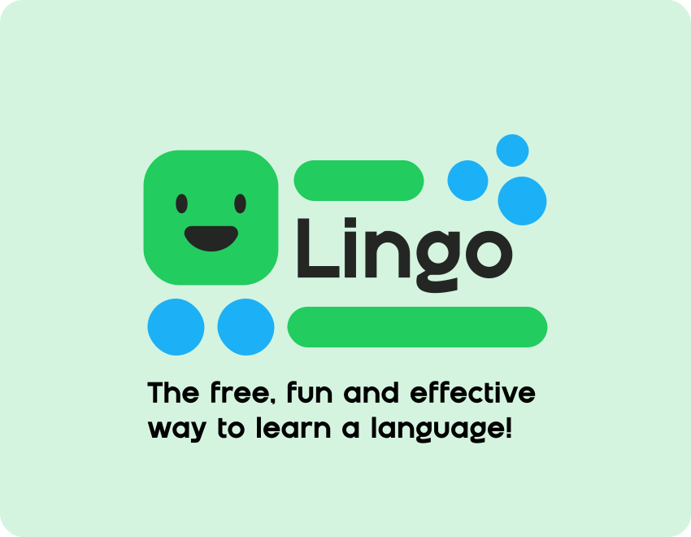

    

## Lingo - Duolingo Clone.

<!-- Add badges here -->

  
  
  
  

---

### "Build a Duolingo Clone With Nextjs, React, Drizzle, Stripe (2024)".

# Key Features:

- 🌐 Next.js 14 & server actions
- 🗣 AI Voices using Elevenlabs AI
- 🎨 Beautiful component system using Shadcn UI
- 🎭 Amazing characters thanks to KenneyNL
- 🔐 Auth using Clerk
- 🔊 Sound effects
- ❤️ Hearts system
- 🌟 Points / XP system
- 💔 No hearts left popup
- 🚪 Exit confirmation popup
- 🔄 Practice old lessons to regain hearts
- 🏆 Leaderboard
- 🗺 Quests milestones
- 🛍 Shop system to exchange points with hearts
- 💳 Pro tier for unlimited hearts using Stripe
- 🏠 Landing page
- 📊 Admin dashboard React Admin
- 🌧 ORM using DrizzleORM
- 💾 PostgresDB using NeonDB
- 🚀 Deployment on Vercel
- 📱 Mobile responsiveness
